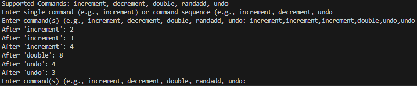

# CommandPatternApp

The program accepts one command line argument: a number value that is used as
initial value of a result variable. The program prompts its user for commands in an
infinte loop. After each prompt, it applies the command and prints out the new result
value.

These commands are supported:

- increment -- increases result value by `1`
- decrement -- decreases result value by `1`
- double -- doubles the result value
- randadd -- changes result by random number
- undo -- reverts the most recent command that is not an undo and was not yet undone

For example, with an inital result value of `1`, the command sequence
`increment, increment, increment, double, undo, undo` produces the result values: `2, 3, 4, 8, 4, 3`

## Build and Run App

```bash
    cd CommandPatternApp

    dotnet build
```

run the app with initial value (say `1`)

```bash
    dotnet run -- 1
```

outputs:


